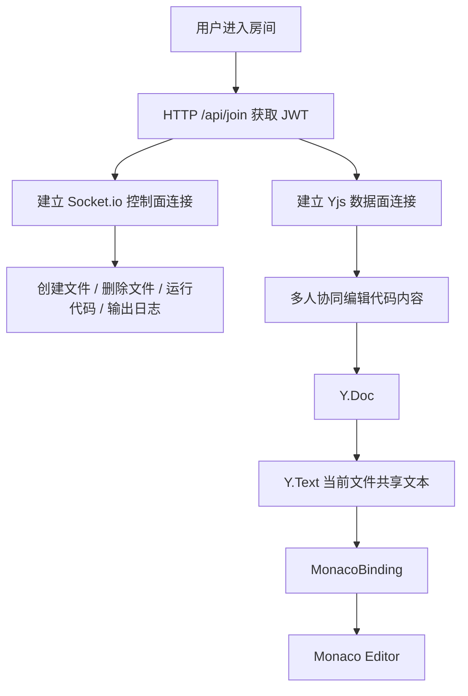

# Web IDE 协作空间

一个基于 **React + Monaco Editor + Socket.io + Yjs** 实现的多人协作 Web IDE 项目，支持用户加入房间、文件树管理、多人实时协同编辑、代码保存、代码运行输出等功能。

本项目重点不只是实现一个在线代码编辑器，而是围绕“多人协作开发场景”设计前端状态管理、实时通信、协同编辑绑定、文件树同步和代码执行流程，适合作为前端实习面试项目展示。

---

## 项目亮点

- 基于 **React + Vite** 搭建前端应用，使用组件化方式拆分登录区、工作区、文件树、编辑器、底部输出面板等模块。
- 集成 **Monaco Editor**，实现接近 VS Code 的代码编辑体验。
- 使用 **Yjs + y-websocket + y-monaco** 实现多人协同编辑，避免普通 Socket 直接传字符串带来的覆盖冲突问题。
- 使用 **Socket.io** 处理控制类实时事件，例如创建文件、删除文件、运行代码、输出日志、文件树广播。
- 使用 **Zustand** 管理全局状态，例如当前房间、Socket 实例、当前激活文件、文件树、底部面板状态等。
- 使用 **Axios 拦截器** 统一处理 API 请求，并自动携带 JWT Token。
- 前后端采用 **控制面 / 数据面分离** 的通信设计：
  - Socket.io 控制面：处理文件操作、运行代码、输出日志。
  - Yjs 数据面：处理协同编辑内容同步。
- 支持刷新后恢复登录状态、恢复房间号、恢复上次打开的文件。
- 支持基于 IndexedDB 的本地协同文档持久化，提升断线和刷新后的恢复体验。

---

## 技术栈

### 前端

| 技术 | 作用 |
| --- | --- |
| React | 构建前端组件和页面 |
| Vite | 前端构建工具 |
| Monaco Editor | 在线代码编辑器 |
| Zustand | 全局状态管理 |
| Axios | HTTP 请求封装 |
| Socket.io-client | 实时控制面通信 |
| Yjs | CRDT 协同编辑核心 |
| y-websocket | Yjs WebSocket 同步通道 |
| y-monaco | Monaco Editor 与 Yjs 绑定 |
| y-indexeddb | 本地协同文档持久化 |
| Tailwind CSS | 页面样式 |
| Allotment | IDE 面板拖拽布局 |
| React Hot Toast | 操作反馈提示 |

### 后端

| 技术 | 作用 |
| --- | --- |
| Node.js | 后端运行环境 |
| Express | HTTP API 服务 |
| Socket.io | 实时控制面通信 |
| ws | WebSocket 服务 |
| y-websocket | Yjs 协同编辑服务端连接处理 |
| JWT | 用户身份认证 |
| dotenv | 环境变量管理 |
| CORS | 跨域处理 |
| node-pty | 终端能力预留 |
| child_process / vm 思路 | 代码运行能力支持 |

---

## 核心功能

### 1. 加入协作房间

用户输入用户名和房间号后，前端调用后端接口获取 JWT Token。登录成功后，前端会：

1. 将 Token、房间号、登录状态保存到 localStorage。
2. 使用 Token 和房间号建立 Socket.io 控制面连接。
3. 进入 IDE 工作区。
4. 启动 Yjs 数据面连接，准备进行协同编辑。

---

### 2. 文件树管理

项目支持文件和文件夹的创建、删除、同步更新。

文件操作通过 Socket.io 发起，例如：

```js
currentSocket.emit('createFile', { filename: path, isFolder }, (response) => {
  // 根据后端返回结果提示创建成功或失败
});
```

删除文件时，前端会等待后端确认删除成功后，再清理本地 Monaco Model 缓存，避免编辑器继续显示已经不存在的“幽灵文件”。

---

### 3. 多人协同编辑

项目没有采用普通 Socket 直接传完整代码字符串，而是采用 Yjs 做协同编辑。

核心流程：

```text
用户在 Monaco Editor 中输入代码
        ↓
MonacoBinding 捕获编辑变化
        ↓
变化写入当前文件对应的 Y.Text
        ↓
y-websocket 同步 Yjs 增量更新
        ↓
其他用户收到更新
        ↓
MonacoBinding 自动更新对方 Monaco Editor
```

每个文件都会对应一个独立的 Y.Text：

```js
const ytext = ydoc.getText(activeFile);
```

这样可以避免多个文件之间的内容串扰。

---

### 4. 远程光标与协同状态

项目通过 Yjs Awareness 机制保存用户信息，例如用户名和颜色，用于显示远程用户光标。

```js
provider.awareness.setLocalStateField('user', {
  name: username,
  color: userColor
});
```

这样可以让协同编辑不只是同步文本内容，还能展示“谁正在编辑哪里”。

---

### 5. 代码保存

保存代码时，前端从 Monaco Editor 实例中读取最新代码内容，然后通过 Axios 调用后端保存接口。

```js
const code = editorRef.current.getValue();

await request.post('/save', {
  roomId,
  code,
  filename: activeFile,
  language: 'javascript'
});
```

这里使用 `useRef` 保存 Monaco Editor 实例，而不是使用 `useState` 保存编辑器内容，主要是为了避免每次输入都触发 React 重新渲染，同时保证保存时能直接读取最新内容。

---

### 6. 代码运行与输出

点击运行时，前端通过 Socket.io 向后端发送执行请求：

```js
currentSocket.emit('executeCode', { roomId, code });
```

后端执行代码后，通过 Socket.io 将输出结果实时推送到前端 Output 面板。

---

## 项目架构

```text
web-ide-project
├── frontend
│   ├── src
│   │   ├── App.jsx
│   │   ├── components
│   │   │   ├── Login.jsx
│   │   │   ├── WorkspaceLayout.jsx
│   │   │   ├── Sidebar.jsx
│   │   │   ├── Header.jsx
│   │   │   ├── CodeEditor.jsx
│   │   │   ├── BottomPanel.jsx
│   │   │   └── OutputPanel.jsx
│   │   ├── hooks
│   │   │   ├── useAuthSession.js
│   │   │   ├── useWorkspaceSocket.js
│   │   │   ├── useWorkspaceActions.jsx
│   │   │   └── useEditorBinding.js
│   │   ├── services
│   │   │   ├── request.js
│   │   │   └── socket.js
│   │   ├── store
│   │   │   └── useIDEStore.js
│   │   └── utils
│   │       ├── constants.js
│   │       ├── fileTree.js
│   │       └── editorLanguage.js
│   └── package.json
│
├── backend
│   ├── index.js
│   ├── src
│   │   ├── app.js
│   │   ├── socket
│   │   │   └── workspaceSocket.js
│   │   ├── yjs
│   │   │   └── yjsServer.js
│   │   ├── services
│   │   │   ├── fileService.js
│   │   │   ├── roomService.js
│   │   │   └── codeService.js
│   │   ├── utils
│   │   │   ├── safePath.js
│   │   │   └── fileTree.js
│   │   └── pty
│   │       └── PtyManager.js
│   └── package.json
```

---

## 核心通信设计

本项目采用“双通道通信”设计。



### 为什么不只用 Socket.io？

普通 Socket.io 更适合“事件通知”，例如：

- 创建文件
- 删除文件
- 运行代码
- 推送运行结果
- 广播文件树变化

但协同编辑需要处理多人同时输入、冲突合并、消息乱序、离线恢复等问题。直接传完整字符串容易出现“后到覆盖先到”的问题。

所以项目中：

- **Socket.io 负责业务事件**
- **Yjs 负责协同编辑数据同步**

---

## 前端核心模块说明

### App.jsx

项目的顶层调度组件，主要负责：

- 判断是否进入房间。
- 组织 Login 和 WorkspaceLayout 的渲染。
- 持有 Monaco Editor 实例引用。
- 调用自定义 hooks 管理登录、Socket、Yjs、编辑器绑定等逻辑。

---

### useAuthSession.js

负责登录、恢复登录状态和退出房间。

核心职责：

- 调用 `/api/join` 获取 Token。
- 将 Token、roomId、isJoined 保存到 localStorage。
- 登录成功后建立 Socket.io 连接。
- 页面刷新时根据 localStorage 恢复状态。

---

### useWorkspaceSocket.js

负责工作区长连接和协同数据初始化。

核心职责：

- 创建 `Y.Doc`。
- 使用 `IndexeddbPersistence` 绑定本地 IndexedDB。
- 使用 `WebsocketProvider` 建立 Yjs 数据面连接。
- 监听 Socket.io 控制面事件，例如运行输出、文件树初始化、断开连接等。
- 在组件卸载时销毁 provider、ydoc 和事件监听器，避免内存泄漏。

---

### useEditorBinding.js

负责 Monaco Editor 和 Yjs 的绑定。

核心职责：

- 根据当前 activeFile 切换 Monaco Model。
- 保存和恢复不同文件的视图状态。
- 使用 `ydoc.getText(activeFile)` 获取当前文件的共享文本。
- 使用 `MonacoBinding` 将 Y.Text、Monaco Model、Editor 和 Awareness 绑定起来。
- 切换文件时销毁旧 binding，避免编辑内容同步到错误文件。

---

### useWorkspaceActions.jsx

负责用户在工作区中的操作行为。

核心职责：

- 创建文件
- 删除文件
- 保存代码
- 运行代码
- 根据后端响应显示成功或失败提示

---

### useIDEStore.js

基于 Zustand 的全局状态仓库。

主要状态包括：

- `isJoined`：是否已进入房间
- `roomId`：当前房间号
- `socket`：Socket.io 实例
- `activeFile`：当前激活文件
- `fileList`：文件树
- `bottomTab`：底部面板当前 Tab
- `outputLogs`：运行输出日志

---

## 后端核心模块说明

### index.js

后端启动入口，负责：

- 创建 Express app
- 创建 HTTP server
- 挂载 Socket.io 控制面
- 挂载 Yjs 数据面
- 启动服务监听端口

---

### workspaceSocket.js

Socket.io 控制面模块，负责：

- 校验 Socket.io 连接中的 JWT
- 让用户加入指定房间
- 初始化房间目录
- 广播文件树
- 处理创建文件、删除文件
- 处理代码运行请求
- 推送代码运行输出

---

### yjsServer.js

Yjs 数据面模块，负责：

- 复用同一个 HTTP server 处理 WebSocket upgrade
- 将 `/socket.io` 请求交给 Socket.io
- 将 `/yjs/:roomId` 请求交给 Yjs
- 对 Yjs 连接进行 JWT 鉴权
- 通过 `setupWSConnection` 建立 CRDT 同步通道

---

## 启动项目

### 1. 克隆项目

```bash
git clone <your-repository-url>
cd web-ide-project
```

---

### 2. 启动后端

```bash
cd backend
npm install
npm run dev
```

后端默认运行在：

```text
http://localhost:3000
```

---

### 3. 启动前端

```bash
cd frontend
npm install
npm run dev
```

前端默认运行在：

```text
http://localhost:5173
```

---

### 4. 前端环境变量示例

在 `frontend/.env.development` 中配置：

```env
VITE_API_BASE_URL=http://localhost:3000/api
VITE_WS_URL=http://localhost:3000
VITE_YJS_URL=ws://localhost:3000/yjs
VITE_ENABLE_TERMINAL=false
```

---

### 5. 后端环境变量示例

在 `backend/.env` 中配置：

```env
PORT=3000
JWT_SECRET=your_jwt_secret
FRONTEND_ORIGIN=http://localhost:5173
ENABLE_TERMINAL=false
```

具体变量名请以项目中的 `config` 文件为准。

---

## 使用流程

1. 打开前端页面。
2. 输入用户名和房间号。
3. 点击加入房间。
4. 进入 Web IDE 工作区。
5. 在左侧文件树选择文件。
6. 在 Monaco Editor 中编辑代码。
7. 打开另一个浏览器窗口，使用相同房间号进入。
8. 两个窗口可以实时看到彼此的编辑内容和光标变化。
9. 点击保存，将当前文件内容保存到后端。
10. 点击运行，在 Output 面板查看运行结果。

---

## 面试讲解重点

### 1. 项目整体介绍

可以这样介绍：

> 这是一个多人协作 Web IDE 项目，核心功能包括房间加入、文件树管理、多人实时编辑、代码保存和代码运行。项目前端使用 React 和 Monaco Editor 实现编辑器界面，使用 Zustand 管理全局状态，使用 Socket.io 处理文件操作和运行输出，使用 Yjs 实现多人协同编辑。项目重点解决的是多人同时编辑代码时的状态同步和冲突合并问题。

---

### 2. 为什么使用 Yjs，而不是普通 Socket 传字符串？

普通 Socket 传字符串只能实现“消息转发”，不能很好解决多人同时编辑时的冲突问题。如果两个用户同时修改同一个文件，简单地传完整字符串很容易出现后到的内容覆盖先到的内容。

Yjs 基于 CRDT，可以把每个用户的编辑操作合并成最终一致的文档状态。项目中通过 `ydoc.getText(activeFile)` 为每个文件创建共享文本，再用 `MonacoBinding` 将共享文本和 Monaco Editor 绑定，从而实现多人实时编辑。

---

### 3. 为什么 Socket.io 和 Yjs 要分开？

因为两者适合处理的问题不同。

Socket.io 适合处理业务事件，例如创建文件、删除文件、运行代码、推送日志。

Yjs 适合处理协同编辑数据，例如文本插入、删除、远程光标、并发合并。

所以项目中将通信拆成控制面和数据面：

```text
Socket.io 控制面：处理业务事件
Yjs 数据面：处理协同编辑
```

这样结构更清晰，也方便后期维护。

---

### 4. 为什么 Monaco Editor 实例用 useRef 保存？

Monaco Editor 是一个复杂的第三方编辑器实例，不适合放进 React state。

如果把编辑器内容或实例放进 useState，每次输入都可能触发 React 重新渲染，影响性能。项目中使用 useRef 保存 editor 实例，需要保存或运行代码时，直接通过：

```js
editorRef.current.getValue()
```

读取最新内容。

---

### 5. 如何避免切换文件时内容同步错乱？

项目中每个文件都有自己的 Monaco Model 和 Y.Text。

切换文件时会：

1. 保存上一个文件的视图状态。
2. 销毁旧的 MonacoBinding。
3. 创建或获取当前文件的 Monaco Model。
4. 使用 `ydoc.getText(activeFile)` 获取当前文件对应的 Y.Text。
5. 重新建立 MonacoBinding。

这样可以避免在 `index.js` 中输入的内容同步到 `style.css` 里。

---

### 6. 如何处理断线重连和刷新恢复？

项目将 Token、房间号、是否已加入房间、当前激活文件保存到 localStorage。

刷新页面后，前端会读取 localStorage：

- 如果 Token 和房间号存在，则恢复登录状态。
- 自动重新建立 Socket.io 连接。
- 自动重新建立 Yjs 数据面连接。
- 恢复上次打开的文件。

同时，Yjs 文档会通过 y-indexeddb 持久化到浏览器本地，提升刷新或短暂断线后的恢复体验。

---

## 项目难点

### 1. 协同编辑冲突处理

难点不是把字符串发送给其他用户，而是多人同时修改同一份代码时，如何保证最终内容一致。项目通过 Yjs 的 CRDT 能力解决这个问题。

### 2. Monaco 与 Yjs 的绑定

Monaco Editor 本身只是编辑器，不负责协同数据同步。项目通过 y-monaco 中的 MonacoBinding，把 Monaco Model 和 Yjs 的 Y.Text 绑定起来。

### 3. 多文件编辑状态管理

不同文件需要不同的 Monaco Model、语言类型、光标位置和 Y.Text。项目通过 fileCacheMap 缓存每个文件的模型和视图状态，切换文件时恢复现场。

### 4. 控制面和数据面拆分

如果把所有功能都塞进 Socket.io，会导致事件复杂、协同逻辑难维护。项目将 Socket.io 和 Yjs 拆分，分别处理业务事件和协同编辑数据。

### 5. 长连接生命周期管理

项目中涉及 Socket.io 连接、Yjs Provider、IndexedDB Provider、MonacoBinding、事件监听器等多个资源。组件卸载或切换文件时必须正确清理，否则容易造成重复监听、内存泄漏或同步错乱。

---

## 后续优化方向

- 增加用户权限控制，例如房主、只读用户、普通协作者。
- 增加文件重命名、拖拽移动文件功能。
- 增加多语言代码运行能力。
- 增加代码运行沙箱隔离，提升安全性。
- 增加协作者列表和在线状态展示。
- 增加保存历史和版本回滚功能。
- 增加项目模板功能，例如 React、Vue、Node.js 模板。
- 增加部署日志和错误监控。

---

## 项目总结

本项目是一个面向多人协作开发场景的 Web IDE。它不仅实现了在线编辑器的基础功能，还重点解决了多人实时编辑中的同步、冲突、文件隔离和状态管理问题。

项目中前端部分重点体现了：

- React 组件拆分能力
- 自定义 Hooks 封装能力
- Zustand 全局状态管理能力
- Axios 请求封装能力
- WebSocket 实时通信能力
- Monaco Editor 集成能力
- Yjs 协同编辑理解能力

后端部分重点体现了：

- Express API 服务设计
- JWT 鉴权
- Socket.io 实时事件处理
- Yjs WebSocket 数据面接入
- 文件系统操作
- 代码执行流程设计

整体上，这是一个适合前端实习面试展示的综合型项目。
