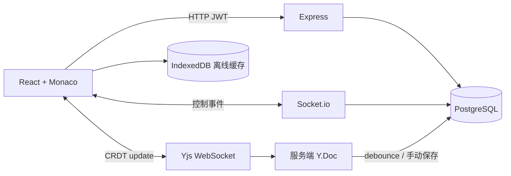
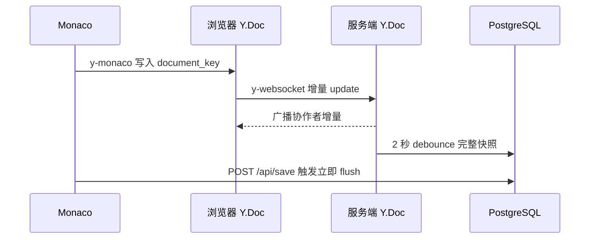
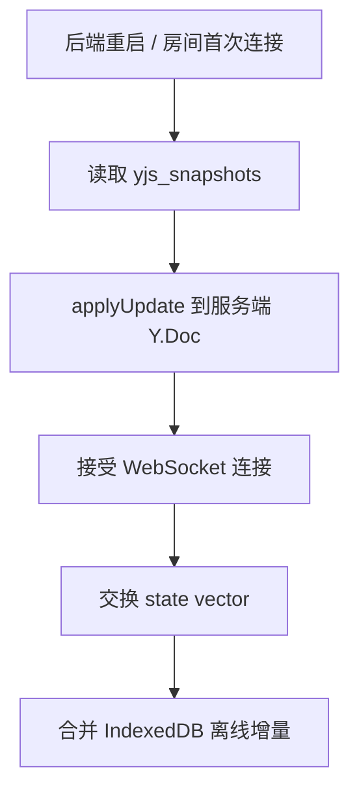

# Web IDE 协作空间

面向多人实时协作场景的 Web IDE。项目使用 React、Monaco Editor、Socket.io 和 Yjs，将业务控制事件与 CRDT 文档同步拆成两条通道，并通过 PostgreSQL 持久化房间文件树和 Y.Doc 快照。

## 已实现能力

- 服务端创建 UUID 房间并一次性返回房主、编辑和只读口令；只保存 `crypto.scrypt` 哈希。
- HTTP、Socket.io、Yjs 统一校验绑定 `sessionId / roomId / username / role` 的 JWT。
- PostgreSQL 保存 `rooms`、`room_files`、`yjs_snapshots`；Yjs 是文件内容唯一真相。
- 文件使用不可变 `document_key` 作为 Y.Text 身份，删除并同名重建不会复用旧内容。
- Yjs 更新 2 秒合并写快照，`POST /api/save` 可立即持久化并返回版本和保存时间。
- Monaco 多 model、视图状态、递归删除清理、Awareness 成员与稳定颜色。
- IndexedDB 离线草稿、Socket/Yjs/synced/dirty/saved 状态和 Cmd/Ctrl+S。
- 代码执行、PTY 终端、AI 默认关闭；生产环境即使误配也不会启用本机执行。
- 路径、数量、层级、消息体、WebSocket payload 与日志容量限制。

## 架构


```mermaid
flowchart LR
  UI[React + Monaco] -->|HTTP JWT| API[Express]
  UI <-->|控制事件| SIO[Socket.io]
  UI <-->|CRDT update| YWS[Yjs WebSocket]
  UI --> IDB[(IndexedDB 离线缓存)]
  API --> PG[(PostgreSQL)]
  SIO --> PG
  YWS --> DOC[服务端 Y.Doc]
  DOC -->|debounce / 手动保存| PG
```

```text
PostgreSQL room_files  = 文件树和文件身份真相
服务端 Y.Doc           = 在线内容真相
PostgreSQL snapshot    = 可恢复持久化副本
浏览器 IndexedDB       = 离线缓存
```


```mermaid
sequenceDiagram
  participant M as Monaco
  participant C as 浏览器 Y.Doc
  participant S as 服务端 Y.Doc
  participant P as PostgreSQL
  M->>C: y-monaco 写入 document_key
  C->>S: y-websocket 增量 update
  S-->>C: 广播协作者增量
  S->>P: 2 秒 debounce 完整快照
  M->>P: POST /api/save 触发立即 flush
```


```mermaid
flowchart TD
  R[后端重启 / 房间首次连接] --> L[读取 yjs_snapshots]
  L --> A[applyUpdate 到服务端 Y.Doc]
  A --> H[接受 WebSocket 连接]
  H --> V[交换 state vector]
  V --> M[合并 IndexedDB 离线增量]
```

## 本地启动

要求 Node.js 20+ 和 PostgreSQL。

```bash
cd backend
cp .env.example .env
# 修改 DATABASE_URL、JWT_SECRET（至少 32 位）
npm install
npm run db:migrate
npm run dev
```

```bash
cd frontend
cp .env.example .env.development
npm install
npm run dev
```

访问前端后先“创建新房间”，立即保存页面只展示一次的 `roomId` 和三种角色口令，再用昵称加入。

## 校验命令

```bash
cd backend
npm test
npm run typecheck
npm run build

cd ../frontend
npm run typecheck
npm run build
npm run lint
```

## API 与实时协议

- `GET /api/health`：服务与数据库状态，不返回凭据。
- `POST /api/rooms`：创建房间，返回一次性房主/编辑/只读口令。
- `POST /api/join`：校验 `roomId + accessCode + username`，签发房间 JWT。
- `POST /api/save`：只相信 JWT 中的 roomId，立即保存当前 Y.Doc。
- Socket.io：`createFile`、`deleteFile`、`executeCode` 及文件树/输出事件。
- Yjs：`/yjs/:roomId?token=...`，URL 房间必须与 Token 房间一致。

## 安全边界与已知限制

- `ENABLE_CODE_EXECUTION=false`、`ENABLE_TERMINAL=false` 是上线默认值。本项目没有把本机子进程包装成“安全沙箱”。
- 尚未实现完整账号体系、房间成员管理、Token 撤销、Git 集成、多语言 Runner。
- AI 仅在后端配置 Key 且显式设置 `VITE_ENABLE_AI=true` 后显示；应用建议前必须确认。
- 当前自动化测试覆盖基础路径、Token 边界和危险开关；数据库、双浏览器协同与断网恢复仍需按部署验收清单手工验证。

上线步骤见 [docs/DEPLOYMENT.md](docs/DEPLOYMENT.md)，演示和简历材料见 [docs/AUTUMN_RECRUITING.md](docs/AUTUMN_RECRUITING.md)。
